# Introduction

Follow these steps to run the project

## 1.Applying for an Account

Go to the [Mini Program Registration page](https://mp.weixin.qq.com/wxopen/waregister?action=step1), and enter and submit the required information as instructed to get your Mini Program account.

In this Mini Program management platform, you can manage permissions of your Mini Program, view data reports, release Mini Programs, etc.

Log in [https://mp.weixin.qq.com](https://mp.weixin.qq.com/), and you can see the **AppID** of y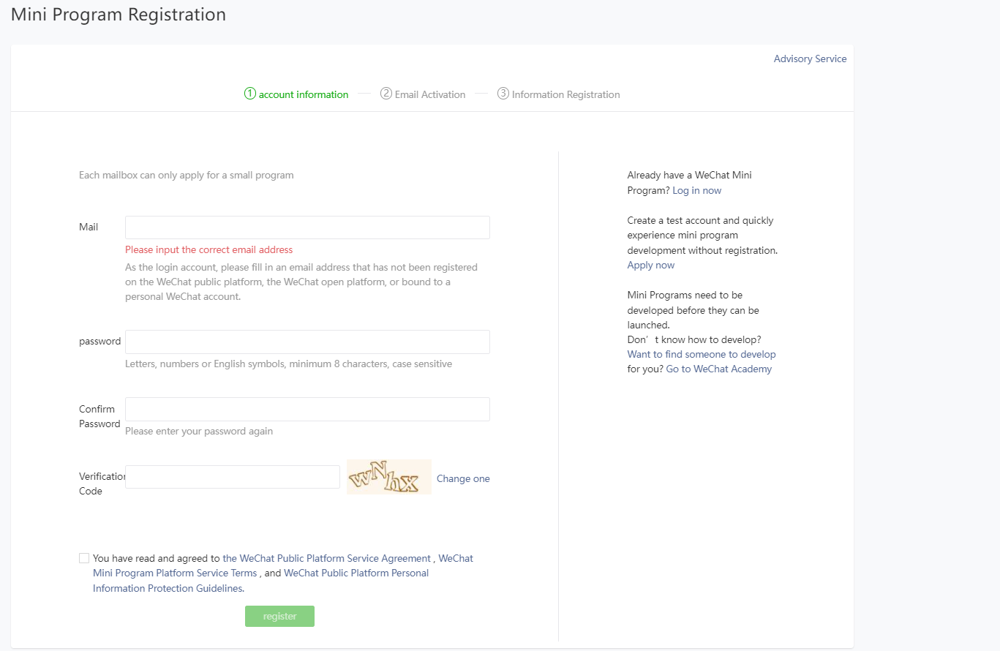our Mini Program in the menu of "Settings" - "Development Settings".

## 2.Log in to wechat development platform

Get appid

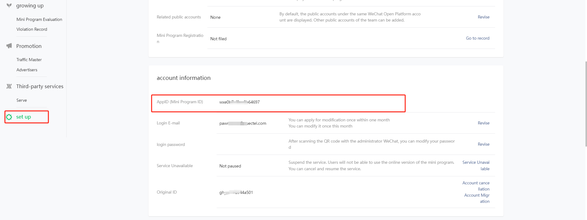

## 3.Add request url

url:https://quec-pawn.oss-cn-shanghai.aliyuncs.com;

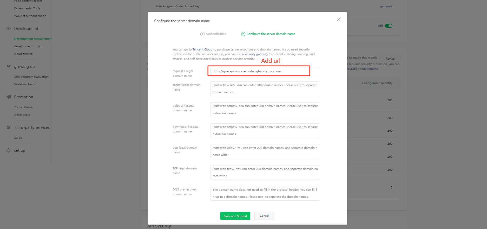

## 4.Install development tools

Go to the [developer toolkit download page](https://developers.weixin.qq.com/miniprogram/dev/devtools/download.html) to download the appropriate installation package for your operating system. More details about the developer toolkit can be found in the [Developer Toolkit Introduction](https://developers.weixin.qq.com/miniprogram/dev/devtools/devtools.html).

Open the Mini Program developer toolkit, and log in by scanning QR code with your Weixin. Now you are ready to develop your first Mini Program!

## 5.Modifying a configuration file

Replace your app id!

file path: miniprogram\project.config.json

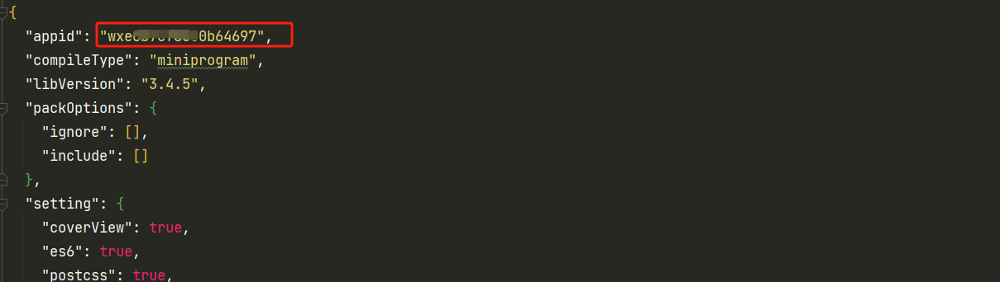

## 6.Load project file

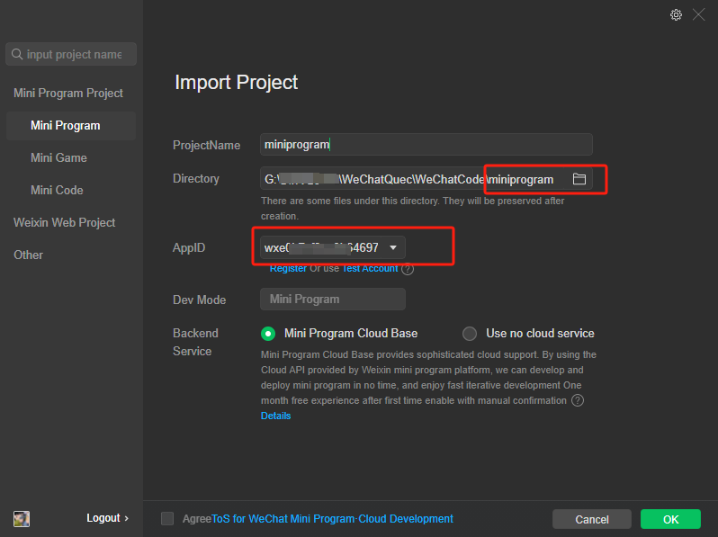

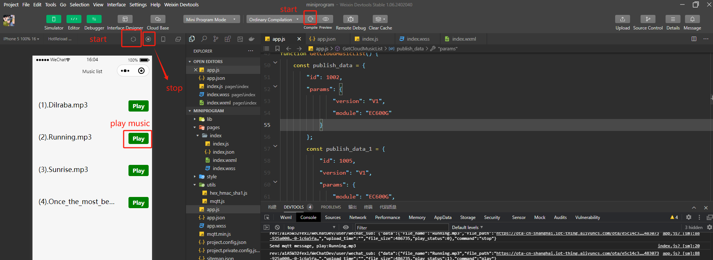

## 6.Mobile phone debug

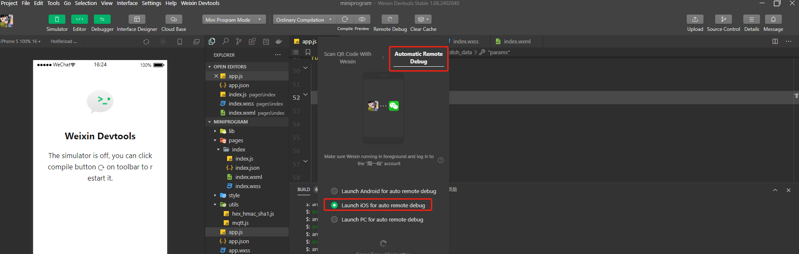

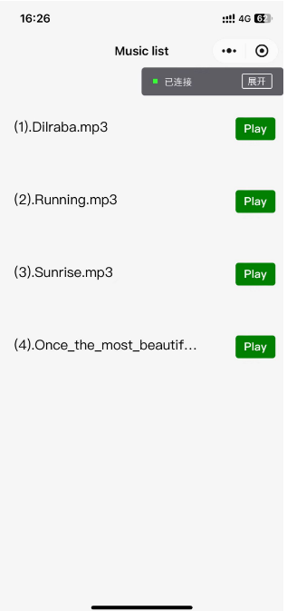

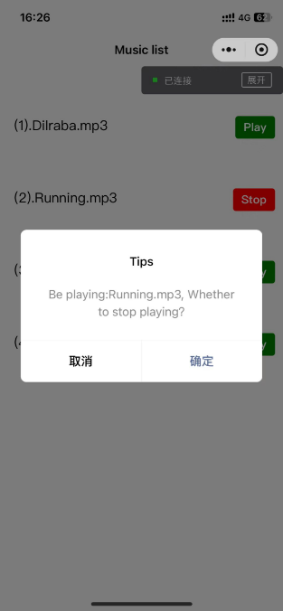

## 6.Module

Module type:EC600MCNLE(Te-A)

Firmware version:EC600MCNLER01A02M08_OCPU_QPY

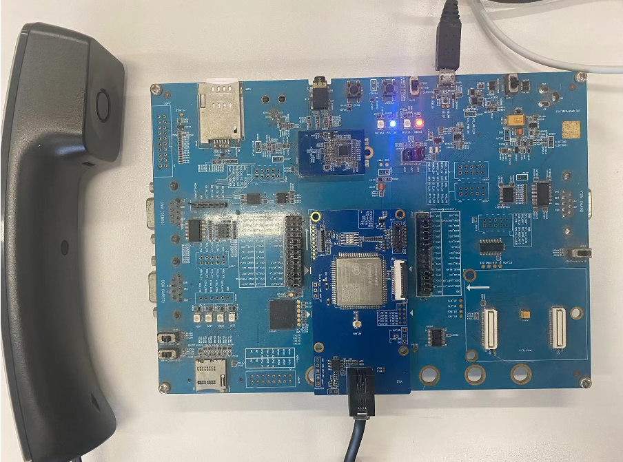

- Upload code to the module

  file path: ./main_t.py

  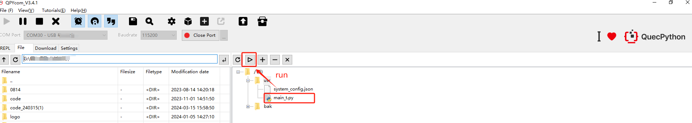

  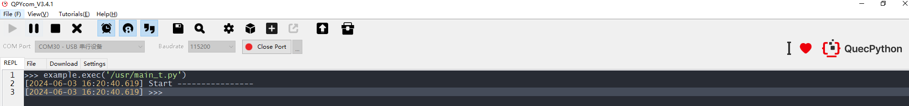

- Run log

  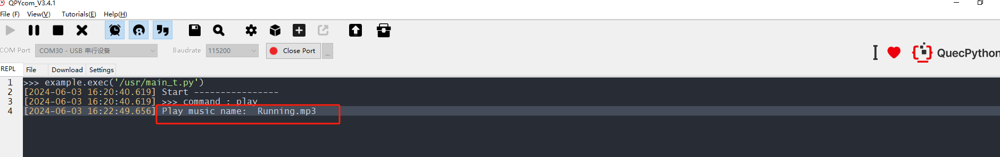

